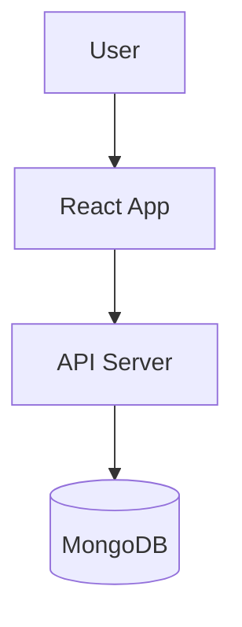

<div align="center">

# ADOÇÃO DE PETS
### PLATAFORMA DE ADOÇÃO


<br />

**Plataforma para adoção responsável de animais com sistema de matching inteligente.**
**Conecta pessoas que querem adotar com animais que precisam de um lar.**

[Getting Started](#-getting-started) • [License](#-license)

</div>

---

## 🏗️ Architecture

This project uses a **Vite/React** frontend and a **Node.js** backend (or Django, depending on specific implementation version) with **MongoDB**.



---

## 🚀 Applications

<div align="center">

| Application | Description | Tech Stack |
|:-----------:|:----------- |:---------- |
| **Frontend** | Interactive UI for browsing pets. | `React` `Vite` `Tailwind` |
| **Backend** | API for managing pet listings and adoptions. | `Node.js` `Express` `MongoDB` |

</div>

---

## 🛠️ Getting Started

### Prerequisites

*   **Node.js 18+**
*   **MongoDB**

### Installation

```bash
# 1. Clone the repository
git clone https://github.com/DionathaGoulart/Pets.git

# 2. Setup Backend
cd backend
npm install
npm start

# 3. Setup Frontend (in a new terminal)
cd ../frontend
npm install
npm run dev
```

---

## 📄 License

This project is proprietary and confidential.

**Copyright © 2026 Dionatha Goulart.**
All Rights Reserved.
